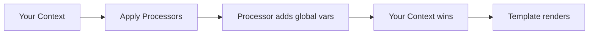

# Context Processors

Context processors are functions that automatically inject variables into every template render. This follows Django's context processor pattern — ideal for injecting global settings, user data, or feature flags.

## Table of Contents

- [How Context Processors Work](#how-context-processors-work)
- [Register a Context Processor](#register-a-context-processor)
- [Context Processor Signature](#context-processor-signature)
- [Overriding Behavior](#overriding-behavior)
- [Real-World Examples](#real-world-examples)
- [Clearing Processors](#clearing-processors)

---

## How Context Processors Work

Context processors run on **every render** (both `render()` and `compile().render()`). They return an object of key/value pairs that are merged into the rendering context **before** your template's local context is applied.



**Key behavior:** Your explicit context values **always win** over processor values. This means you can override global defaults per-render without fighting the processor.

## Register a Context Processor

=== "CommonJS"

    ```javascript
    const { registerContextProcessor } = require('miki-template');

    registerContextProcessor((context) => {
      return {
        siteName: 'My App',
        currentYear: new Date().getFullYear(),
        debug: process.env.NODE_ENV !== 'production'
      };
    });
    ```

=== "ES Modules"

    ```javascript
    import { registerContextProcessor } from 'miki-template';

    registerContextProcessor((context) => {
      return {
        siteName: 'My App',
        currentYear: new Date().getFullYear(),
        debug: process.env.NODE_ENV !== 'production'
      };
    });
    ```

### Multiple Processors

You can register multiple processors. They run in order — later processors can overwrite earlier ones:

=== "CommonJS"

    ```javascript
    const { registerContextProcessor } = require('miki-template');

    registerContextProcessor(() => ({ siteName: 'My App' }));
    registerContextProcessor(() => ({ version: '2.0.0' }));
    registerContextProcessor(() => ({
      footerText: '© 2024 My App. All rights reserved.'
    }));
    ```

=== "ES Modules"

    ```javascript
    import { registerContextProcessor } from 'miki-template';

    registerContextProcessor(() => ({ siteName: 'My App' }));
    registerContextProcessor(() => ({ version: '2.0.0' }));
    registerContextProcessor(() => ({
      footerText: '© 2024 My App. All rights reserved.'
    }));
    ```

## Context Processor Signature

The processor function receives the rendering `context` as an argument and must return a plain object:

```javascript
registerContextProcessor((context) => {
  // context is the full Context object — you can inspect contextObj
  // but don't mutate it
  return {
    key: 'value'
  };
});
```

**Important:** If a processor returns `null`, `undefined`, or nothing, it's treated as returning an empty object `{}`. Processors must **not** return a Promise — if you need async data, compute it before rendering and pass it as context.

## Overriding Behavior

Since your explicit context always wins, you can override global defaults per-render:

=== "CommonJS"

    ```javascript
    const { render } = require('miki-template');

    // processor sets debug: false
    // but this render overrides it:
    render(template, { debug: true });
    ```

=== "ES Modules"

    ```javascript
    import { render } from 'miki-template';

    render(template, { debug: true });
    ```

## Real-World Examples

### App-wide Settings

=== "CommonJS"

    ```javascript
    const { registerContextProcessor } = require('miki-template');

    registerContextProcessor(() => ({
      appName: process.env.APP_NAME || 'MyApp',
      appVersion: require('./package.json').version,
      environment: process.env.NODE_ENV || 'development',
      apiUrl: process.env.API_URL || 'http://localhost:3000/api',
      assetsUrl: process.env.ASSETS_URL || '/assets'
    }));
    ```

=== "ES Modules"

    ```javascript
    import { registerContextProcessor } from 'miki-template';
    import pkg from './package.json' with { type: 'json' };

    registerContextProcessor(() => ({
      appName: process.env.APP_NAME || 'MyApp',
      appVersion: pkg.version,
      environment: process.env.NODE_ENV || 'development',
      apiUrl: process.env.API_URL || 'http://localhost:3000/api',
      assetsUrl: process.env.ASSETS_URL || '/assets'
    }));
    ```

### User Authentication

=== "CommonJS"

    ```javascript
    const { registerContextProcessor } = require('miki-template');

    registerContextProcessor((context) => {
      const user = context.get('user');
      if (!user) return {};
      return {
        user_name: user.name,
        user_avatar: user.avatar || '/default-avatar.png',
        user_is_admin: user.isAdmin || false
      };
    });
    ```

=== "ES Modules"

    ```javascript
    import { registerContextProcessor } from 'miki-template';

    registerContextProcessor((context) => {
      const user = context.get('user');
      if (!user) return {};
      return {
        user_name: user.name,
        user_avatar: user.avatar || '/default-avatar.png',
        user_is_admin: user.isAdmin || false
      };
    });
    ```

### Feature Flags

=== "CommonJS"

    ```javascript
    const { registerContextProcessor } = require('miki-template');

    registerContextProcessor(() => ({
      flags: {
        newDashboard: process.env.FEATURE_NEW_DASHBOARD === 'true',
        betaFeature: process.env.FEATURE_BETA === 'true',
        darkModeDefault: process.env.FEATURE_DARK_MODE === 'true'
      }
    }));
    ```

=== "ES Modules"

    ```javascript
    import { registerContextProcessor } from 'miki-template';

    registerContextProcessor(() => ({
      flags: {
        newDashboard: process.env.FEATURE_NEW_DASHBOARD === 'true',
        betaFeature: process.env.FEATURE_BETA === 'true',
        darkModeDefault: process.env.FEATURE_DARK_MODE === 'true'
      }
    }));
    ```

Template usage:

```html

  <a href="/new-dashboard">New Dashboard</a>

  <a href="/dashboard">Classic Dashboard</a>

```

## Clearing Processors

Clear all registered processors (useful in tests or dynamic configuration):

=== "CommonJS"

    ```javascript
    const { clearContextProcessors } = require('miki-template');

    clearContextProcessors();
    ```

=== "ES Modules"

    ```javascript
    import { clearContextProcessors } from 'miki-template';

    clearContextProcessors();
    ```

## Next Steps

- [Advanced Usage: Context Processors](./advanced-usage)
- [Async Rendering](./async-rendering)
- [API Reference: Context Processors](../api/context-processors)
